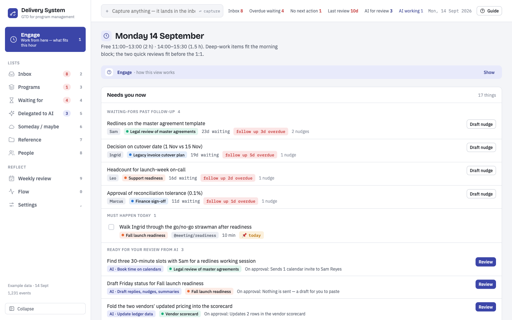
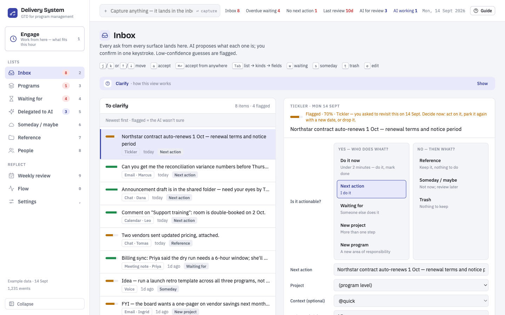
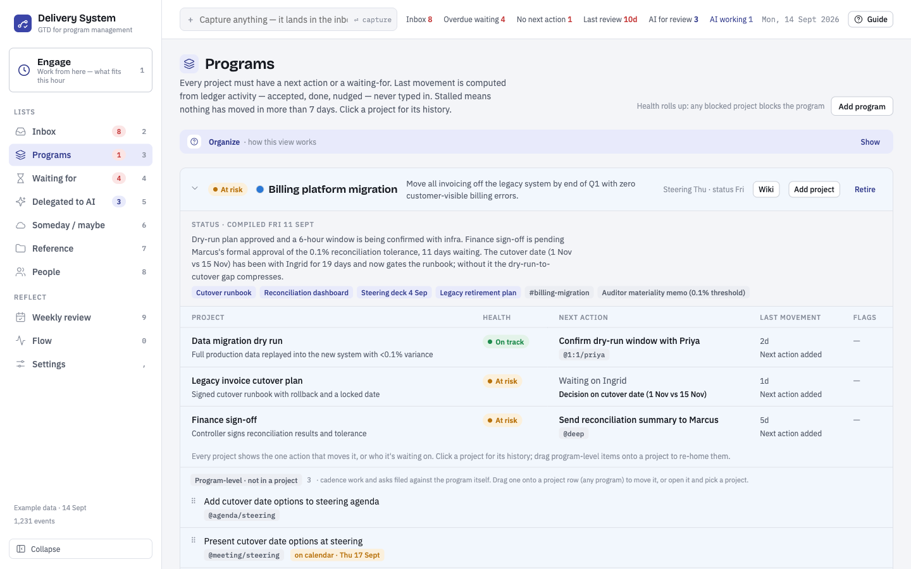
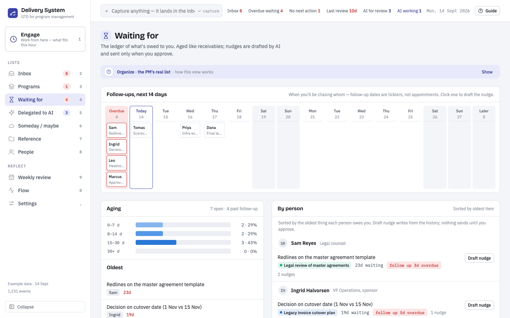
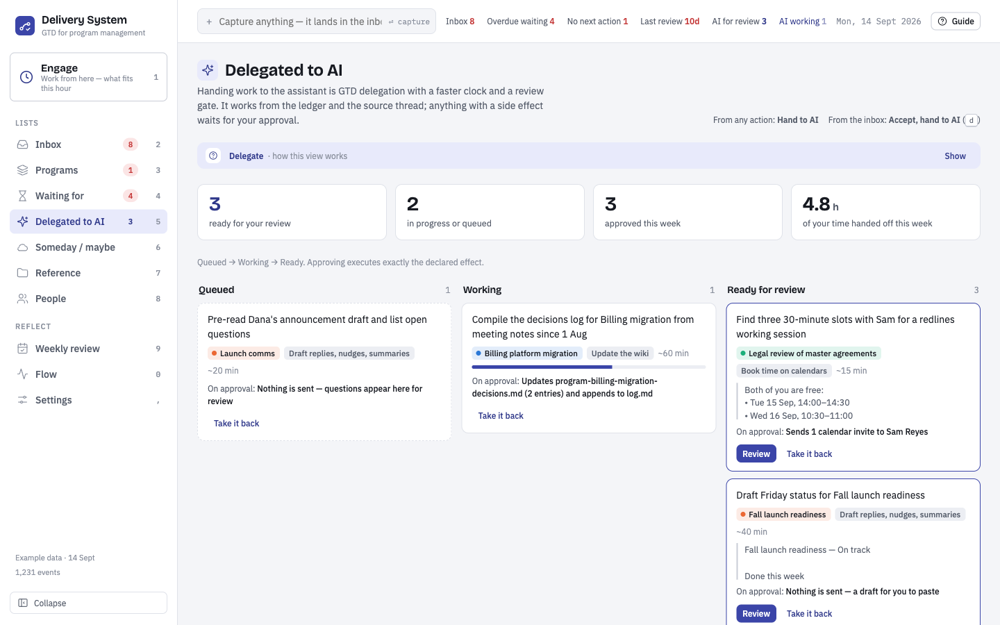
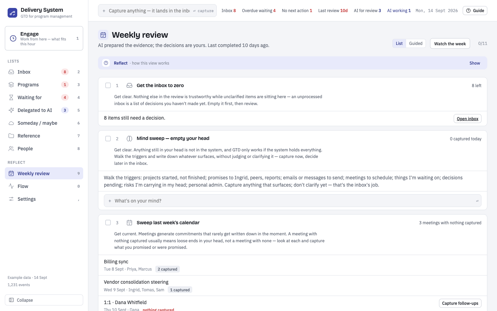
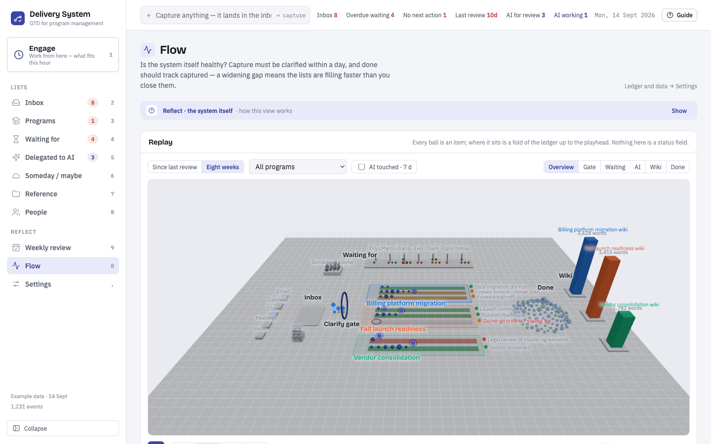
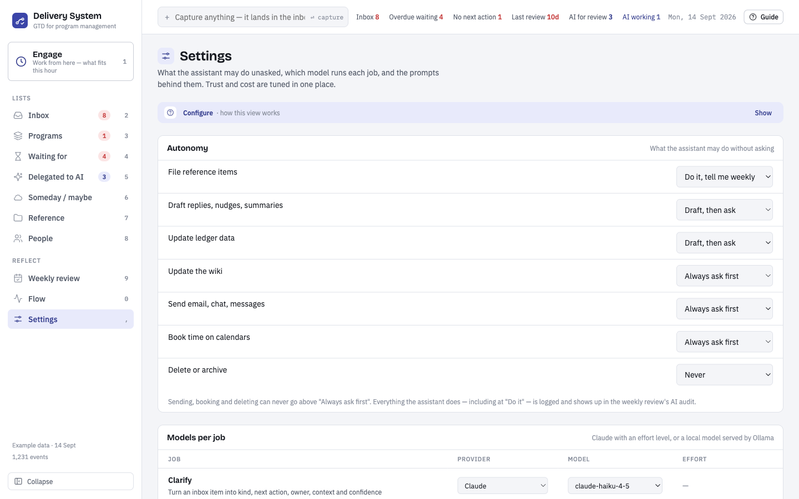

# Delivery System

An AI-assisted Getting Things Done system for program management — capture from anywhere, let the AI clarify, keep the decisions yourself.



## Download

[](https://github.com/jeff-mettel/gtd-system/releases/latest)

**macOS (Apple Silicon): [Delivery-System-macOS.dmg](https://github.com/jeff-mettel/gtd-system/releases/latest/download/Delivery-System-macOS.dmg)** — always the newest build · [all releases](https://github.com/jeff-mettel/gtd-system/releases/latest)

First launch: the app is not notarized yet, so **right-click → Open** (once) instead of double-clicking. Your data lives in `~/GTD-data`, outside the app; see [docs/desktop.md](docs/desktop.md).

## What it does

The system tracks *commitments* — what you owe, what's owed to you, by whom, since when —
organized as programs → projects → next actions. AI handles the high-volume stages
(clarifying captures, drafting nudges and prep briefs, preparing the weekly review,
compiling the program wiki); you own the two moments that create trust: confirming what
an item *is*, and doing the weekly review. The AI never sends, books or deletes without
your approval, and every AI write is tagged in an append-only ledger.

| | |
|---|---|
| **Inbox — clarify** · Every capture arrives with the AI's proposal (kind, next action, project, owner, confidence). `a` accepts, or correct it; ⌘⏎ from any field. |  |
| **Programs — organize** · Every project shows the one action that moves it, or who it's waiting on; stalled and no-next-action are flagged. Status is compiled from the ledger into the program wiki. |  |
| **Waiting for — the PM's real list** · What's owed to you, aged like receivables, with a 14-day follow-up strip. Draft nudge writes from the history; nothing sends until you approve. |  |
| **Delegated to AI** · Hand work to the assistant like to a person: queued → working → ready for your review. Approving executes exactly the declared effect. |  |
| **Weekly review — reflect** · GTD's keystone habit with the evidence pre-gathered: inbox to zero, mind sweep, calendar sweeps, every project covered, aged waiting-fors, someday, wins, AI audit, wiki lint, horizons. |  |
| **Flow — the system itself** · A replay of the ledger: every item is a ball moving through capture, clarify, programs, waiting, the AI, done — with each program's wiki growing at the end of its lane. |  |
| **Settings** · Autonomy per capability, the model behind each AI job (Claude or local), prompts, options, and your data (export, import, backup). |  |

Capture from anywhere with **⌘K** (`@project fri ~20m` files it straight to Engage), jump with **⌘P**, and work every list with `j/k ⏎ x d p n m`.

## Layout

| Path | What |
|---|---|
| `packages/ledger/` | Event schema v1, validation, fold, upcasters, ids, and the demo fixture. Every writer imports it. |
| `server/` | The local service: the only ledger writer, JSON API, `claude -p` job runner with per-job model tiers, scheduler, macOS/connector calendar ingest, backup (git commit of the data repo). |
| `bin/gtd` | CLI — thin client of the server; the write path for Claude jobs (`GTD_ACTOR` required). `bin/gtd-hook` is the PreToolUse guard. |
| `.claude/agents`, `.claude/skills` | The Claude jobs (`gtd-clarify`, `gtd-suggest`, `gtd-nudge`, `gtd-prep`, `gtd-review`, `gtd-compile`, `gtd-ingest-calendar`) and the harness deny rules. |
| `frontend/` | The event-sourced front-end (Vite, plain ES modules): `src/store.js` (commit/fold, server or local backend), `src/views`, `src/drawers`, `src/features`, `src/replay`. Built output is served by the server and published as the demo artifact. |
| `docs/beta-plan.md`, `docs/ledger-events.md`, `docs/runbook-beta.md` | The beta plan, the event contract, and how to install/run/upgrade. |
| `docs/architecture.md` | The architecture: GTD mapping, data model, capture, clarify engine, views, agents, trust invariants, phasing. |
| `docs/backend-wiring.md` | How the front-end connects to a real back-end: event log, endpoints, the five typed model calls, confidence gating, evals. |
| `docs/subscription-wiring.md` | The same back-end on a Claude subscription instead of an API key: skills + subagents per tier, the `gtd` CLI as the single write path, harness-enforced trust rules. |
| `docs/wiki.md` | The program wiki (Karpathy pattern): ledger vs. wiki, page structure, compiled-section markers, the three write paths, lint. |
| `wiki/` | The wiki itself — hub, decisions, timeline, risks per program; person pages; `index.md` + `log.md`. Seeded with example programs. |
| `docs/delegation.md` | Delegating work to the AI: the three levels, the review gate, autonomy settings, how it shows in each view. |
| `docs/decisions.md` | Running log of design decisions made in collaboration, newest first. |

## Status

Beta foundation: event-sourced front-end over a local service and the `packages/ledger` contract; Claude jobs run under your subscription via `claude -p`; Google Calendar via macOS Calendar or the connector. See `docs/runbook-beta.md` to run it on real data (empty start, data in `~/GTD-data`).

Published prototype: https://claude.ai/code/artifact/11289ecb-31a3-4cdc-a8e5-c7b3861d58b6

## Running it

```bash
npm install && npm run build && npm run serve
```

Then open http://localhost:4310 (data in `~/GTD-data`, created on first run). For front-end work: `cd frontend && npm run dev` (http://localhost:5173, `?demo=1` for example data). Everything is client-side; "Reset demo data" on the
Flow view clears localStorage. `npm test` runs the Vitest suites (event log, fold);
`npm run lint` runs ESLint; `npm run build:artifact` writes `dist/` plus
`dist/artifact.html`, the fragment published to the artifact URL above.
